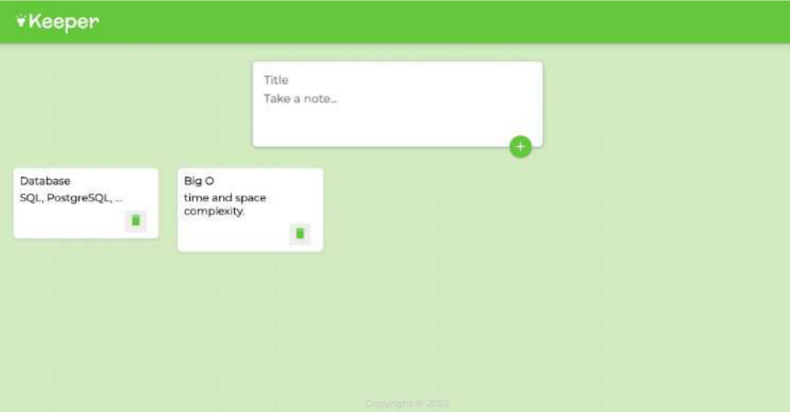

# Google Keep Notes
### Projektni zadatak - Web programiranje

---
### Opis aplikacije
- <b>Google Keep Notes</b> je aplikacija za raditi bilješke
- ideja je napraviti aplikaciju po uzoru na nju

### Aplikacija trebala bi imati sljedeće:
- [] intuitivan i lijepo uređen te dovršen prikaz bez grešaka pri izvršavanju (sami osmisliti dizajn aplikacije, slika je samo primjer)

- [] barem tri prikaza (npr. početna/glavna stranica sa bilješkama, stranica za uređivanje profila i about) i na jednom od prikaza dohvatiti podatke s nekakvog API-ja npr. vrijeme danas
- [] responzivan dizajn (koristiti Bootstrap)
- [] login koristeći username i password
- [] pohrana bilješkii izvršavanje CRUD operacija u sustavu baze podataka
- [] pregledno strukturiran projekt smješten u nekoliko datoteka

### Očekivana tehnička aplikacija aplikacije:
1. tip projekta: <b>full-stack web aplikacija</b>
2. ciljani framework: <b>Node.js (Express)</b> + <b>ReactJS</b>
3. ciljana baza podataka: <b>MySQL/MongoDB</b>